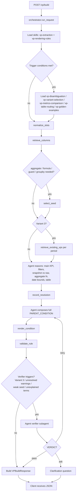
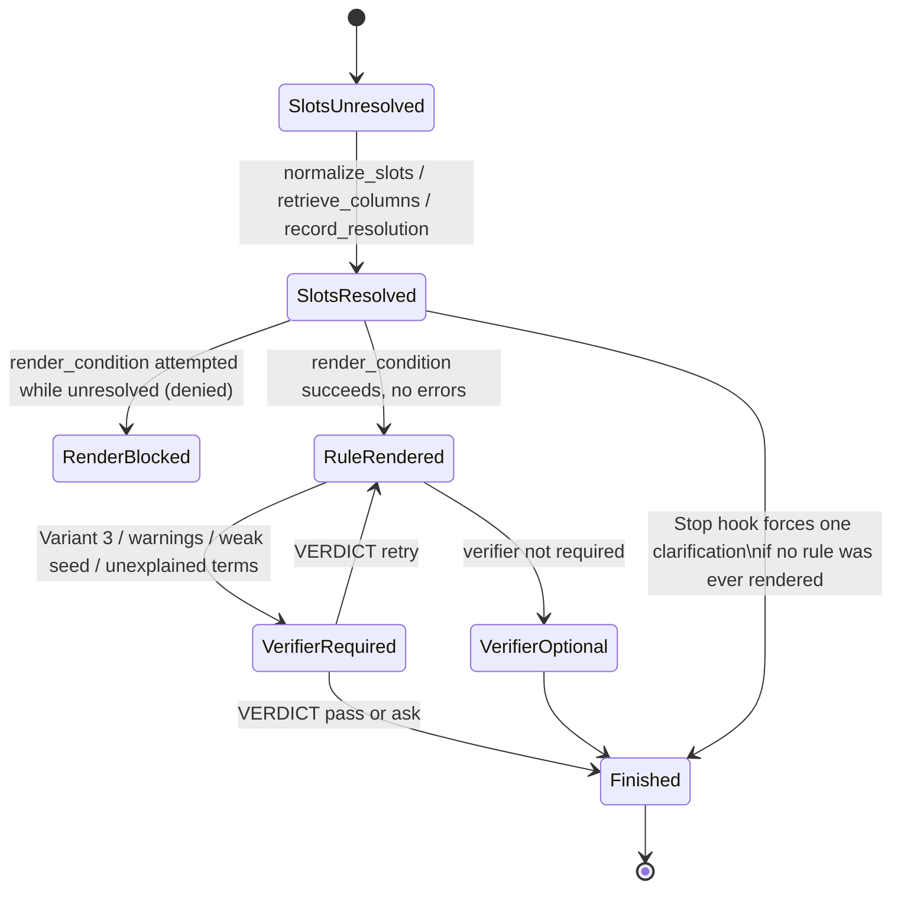

# VP Agent — Architecture

This document explains how the VP Agent is put together: the harnesses that
run it, the skills that carry its procedural/business knowledge, the
end-to-end request flow, how edge cases and failures are handled, and how
the agentic "loop" actually works under the hood.

It complements, but does not replace, `AGENTS.md` (project rules) and
`.claude/CLAUDE.md` (the two hard invariants). Read those first if you
haven't.

## 0. Glossary

If you're new to this project, start here — the rest of the document
assumes these terms.

| Term | Meaning |
|---|---|
| **VP** | Virtual Profile — the downstream campaign/audience platform's rule format for describing "which customers belong in this segment." |
| **`PARENT_CONDITION`** | The actual condition string the platform executes, e.g. `TOTAL_RECHARGE_30D ${operator} ${value}`. Every VP is, at bottom, one of these strings. It is the *only* output this project is allowed to hand-write, and only inside `render_condition`. |
| **Slot** | A structured field extracted from the marketer's sentence — KPI phrase, filters, time token, operator/value, domain, aggregate intent, etc. Slots are the agent's working model of "what was asked," before any column/table has been chosen. |
| **KPI** | Key Performance Indicator — a named metric column (e.g. total recharge amount, data usage, handset type) the platform can filter or aggregate on. |
| **Seed** | A reviewed template for a `PARENT_CONDITION`, stored in the seed catalog, that already encodes the right aggregate function, null guards, and `__groupby_` structure for a class of requests (e.g. "aggregate metric over N days, per subscriber"). Rendering usually fills in a seed's template rather than composing from nothing. |
| **Variant 1 / 2 / 3** | Three shapes of VP rule: **Variant 1** — single table, no join. **Variant 2** — multiple tables, filters resolved first and the aggregate KPI last. **Variant 3** — a metric comparison between two explicit periods (uplift, downlift, % change). |
| **MCP tool** | A tool exposed to the model over the Model Context Protocol. This project's own tools are namespaced `mcp__vp__*` (e.g. `mcp__vp__render_condition`) and are implemented in `vp_agent/server.py` + `vp_agent/tools/*.py`. |
| **Skill** | A markdown file under `.claude/skills/` that carries procedural or business knowledge (how to phrase a clarification, which table to prefer, how to compute a percentage decline). Skills are loaded into context on demand, not hard-coded into Python. |
| **Subagent** | A separate, more narrowly-scoped Claude Agent SDK session launched *by* the orchestrator mid-request (here: the `verifier`), with its own tool/skill restrictions and turn budget. |
| **Hook** | A callback wired into the Claude Agent SDK session (`PreToolUse`, `PostToolUse`, `Stop`) that runs deterministic Python around every tool call, without going through the model. This is how the harness enforces ordering and surfaces warnings. |
| **Harness** | The deterministic scaffolding — options, tools, hooks, and prompt — wrapped around an LLM session so it behaves reliably. See §2 for the full breakdown. |
| **`ToolState`** | The one shared, mutable record (`vp_agent/schemas.py`) that both hooks and the API read/write for a single request — slots resolved, rule rendered, validation result, verifier verdict, full trace. |

## 1. What the agent does

The VP Agent turns a plain-English telecom audience request (e.g. *"Omani
nationals with smartphones who recharged more than 5 OMR in the last 30
days"*) into a validated `PARENT_CONDITION` — the Virtual Profile (VP)
condition syntax used by the downstream campaign/audience platform, for
clients like `omantel` and `airtel`.

It is deliberately **not** a deterministic rules engine. The two hard
invariants (from `AGENTS.md` / `.claude/CLAUDE.md`) are:

1. VP condition syntax is only ever written inside the `render_condition`
   tool call — never hand-typed by the model elsewhere.
2. Routing, rendering, validation, and metadata lookup are deterministic
   tool outputs. The LLM owns interpretation: decomposing the request,
   resolving ambiguity, choosing columns/tables/operators, and deciding
   what to retry.

Business knowledge (which column to prefer, how to phrase a clarification,
what "high value" might mean) lives in **skills**, **reviewed memory**
(golden cases, past production VPs), and **seed metadata** — not in Python
`if` branches.

## 2. Harnesses

"Harness" in this codebase means the deterministic scaffolding — options,
tools, hooks, and prompt — wrapped around an LLM session so it behaves
reliably. There is **one production/live harness** and **three
offline/eval harnesses** that test it from different angles.

| # | Harness | Files | Role |
|---|---|---|---|
| 1 | **Orchestration harness** (the live one) | `vp_agent/orchestrator.py`, `vp_agent/hooks.py`, `vp_agent/schemas.py`, `vp_agent/server.py`, `.claude/settings.json` | Runs one Claude Agent SDK session per incoming request: extraction → retrieval → resolution → render → validate → (optional) verify. This is the harness `HARNESS_FIXES.md` documents fixes for. |
| 2 | **Syntax-coverage audit harness** | `scripts/audit_syntax_coverage.py` | Offline, no LLM calls. Checks that the skills under `.claude/skills` (the agent's only procedural memory) actually cover the syntax constructs seen in real production VPs. |
| 3 | **Live agentic eval harness** | `scripts/eval_agentic.py` | Drives the real orchestration harness against a labeled CSV of NL → expected-condition pairs. Needed because agentic output is non-deterministic run to run. |
| 4 | **Baseline-vs-optimized regression harness** | `scripts/compare_vp_variants.py` (+ `VP_VARIANT` env) | Health-checks two live API deployments (e.g. ports 8000/8001) and runs identical cases through both, to compare a baseline build against an optimized one. |

Extraction, routing, rendering, and validation are **not** separate
harnesses — they're pipeline stages inside the one orchestration harness,
driven by a single Claude Agent SDK session ("one orchestrator session per
request").

Entry points into the orchestration harness:

- CLI → `vp_agent/cli.py` → `orchestrator.run_request`
- API → `vp_agent/api.py` (`POST /vp/build`) → `orchestrator.run_request`
- Both launched via `scripts/run_api.sh`

> **Security note:** `scripts/run_api.sh` currently has a live-looking
> OAuth token committed in plaintext (plus a second, commented-out one).
> This should be rotated and moved to an untracked env file — flagging
> here since it surfaced during this review, separate from the
> architecture write-up itself.

### 2.1 Orchestration harness internals

**`vp_agent/orchestrator.py`**
- `ORCHESTRATOR_APPEND` — a large system-prompt append on top of the
  Claude Code preset prompt. This is the actual pipeline spec: two-stage
  skill loading, evidence-gathering rules, decision rules (filters, main
  KPI, snapshot vs. raw, aggregate, date bounds, ordering),
  `record_resolution`, manual template composition, `render_condition`,
  `validate_rule` warning-handling discipline, verifier-subagent trigger
  conditions, and the clarification-only exit contract.
- `build_agents()` — defines exactly one subagent, `"verifier"`
  (`.claude/agents/verifier.md`), restricted to
  `tools=["Skill","Read","mcp__vp__retrieve_existing_vps","mcp__vp__validate_rule"]`,
  `skills=["vp-metrics-comparison"]`, `maxTurns=5`. It is deliberately
  denied the orchestrator's own procedural skills so it re-derives the
  answer independently instead of restating the author's reasoning.
- `build_options()` — builds `ClaudeAgentOptions`:
  `tools=["Skill","Read","Agent"]` (narrowed on purpose, see §5),
  12 `mcp__vp__*` tools via `allowed_tools`, `disallowed_tools=["Bash"]`,
  `skills="all"`, `mcp_servers={"vp": create_vp_server()}`,
  `hooks=make_hooks(state)`, `max_turns=25` by default.
- `run_request()` — stores the real request/client on shared state (so
  hooks validate against what the user actually asked, not whatever the
  model echoes back), then streams one `ClaudeSDKClient` session.

**`vp_agent/hooks.py`** — the enforcement layer, three hook types:

- **PreToolUse**
  - Marks slots as resolved once `normalize_slots` / `retrieve_columns` /
    `record_resolution` has run.
  - **Denies `render_condition`** until slots are resolved.
  - **ToolSearch loop-breaker**: if the model searches for a tool schema
    it already has but doesn't call, more than once, the search is denied
    with an explicit "stop searching, call the tool directly" message.
  - **Denies `Agent`** (subagent launch) until a rule has actually been
    rendered, and caps any one subagent to 3 launches per request.
- **PostToolUse**
  - Records every tool call/response into a shared trace and structured
    `ToolState` fields.
  - After `retrieve_columns`: flags any request word that never reached a
    submitted role, as a soft warning (not a hard block).
  - After `render_condition`: immediately runs `validate_rule` against the
    real stored request; hard-blocks on errors, surfaces warnings and
    seed-clause regressions as advisory context the model must address.
  - Flags (but doesn't trust) any non-`render_condition` tool output that
    tries to smuggle a `parent_condition`.
- **Stop**
  - Fires at most once per request. If the run is ending with no rendered
    condition, it blocks and forces either completing the pipeline or
    emitting exactly one `Clarification question: ...` line — so a run can
    never silently end with nothing.

**`vp_agent/schemas.py` — `ToolState`**
A single mutable object shared by the whole request: request/client,
slot/render progress flags, resolution, selected seed, validation result,
verifier verdict, retrieval/seed audit ids, subagent launch counts, and
the full tool-call trace. This is the audit backbone hooks and the API
layer both read from.

### 2.2 The 12 MCP tools (`vp_agent/server.py`)

These are every capability the model has, beyond reading skills and
launching the verifier. Each is implemented as a thin wrapper around a
pure-Python function in `vp_agent/tools/*.py` — the tool layer does no
business reasoning, it just executes deterministic lookups/computations
and hands evidence back.

| Tool | Backing module | What it does |
|---|---|---|
| `normalize_slots` | `tools/normalize.py` | Regex-based first pass over the raw sentence. Returns **only** mechanical fields — operator, value, time token, filters. Deliberately withholds domain/kpi_phrase/aggregate/negation, because those require judgment the model must supply. |
| `retrieve_columns` | `tools/retrieve.py` | The main retrieval call. One batched request covering the metric role, every filter role, and the time role. Hybrid-ranks candidates (`0.5 × BM25-normalized` + `0.5 × embedding-normalized` char-3-gram cosine, plus small metadata/time-window/client-prior tiebreakers — `retrieval_index.py`), applies per-role gating, and returns the top 5 candidates per role with observed values, production usage stats, adaptation notes, and unexplained terms. Supports paging (`page` 2/3) against the same `audit_id` for a genuinely unresolved role only. |
| `retrieve_existing_vps` | `tools/retrieve_vps.py` | Ranks previously-approved client VP rows by token coverage, name precision, and semantic similarity. Used to find reusable helper VPs, especially both operands of a Variant-3 comparison. |
| `record_resolution` | (inline in `server.py`) | Pure audit record — stores the agent's semantic decision (selected columns/VPs, seed, path, snapshot flag, dependencies) with **no logic of its own**. This is what flips the `slots_seen` gate. |
| `shelf_lookup` | `tools/shelf.py` | Checks whether a single KPI/time-token pair has a precomputed 360 Profile "shelf" KPI available. |
| `route_table` | `tools/router.py` | Deterministically routes a domain/token (+ optional KPI group) to a source table. *Legacy/compatibility tool — not in the orchestrator's live `allowed_tools`; table choice in the live path comes from the retrieved KPI's own `group_name` instead (see §5).* |
| `select_seed` | `tools/seed.py` | Scores seed-catalog entries against client, time axis, KPI-axis phrase match, aggregate intent, and 360-vs-raw preference. Returns one proposed seed plus up to 3 structurally diverse alternatives; flags a weak/one-survivor field via `supply.advisory`. |
| `build_condition_plan` | `tools/plan.py` | Assembles deterministic `render_condition` input from slots/columns/route/seed. *Legacy/compatibility tool, not part of the live orchestrator path — does not emit syntax itself either way.* |
| `render_condition` | `tools/render.py` | **The only legal emitter of `PARENT_CONDITION` syntax.** Takes a seed/template, variables, and resolved filters and renders the final string. Everything upstream exists to feed this one call correctly. |
| `validate_rule` | `tools/validate.py` | Structural + semantic check of a rendered rule: placeholder discipline, known columns, groupby ordering, unrendered stated numbers, intent cues missing from the rule, and shape differences vs. existing production VPs for the same column. |
| `episodic_lookup` | `tools/memory.py` | Looks up reviewed prior human corrections for similar slots/client — a memory surface for recurring mistakes. |
| `queue_correction` | `tools/memory.py` | Queues a marketer/verifier correction for human review before it's trusted as reinforcement. |

## 3. Skills (`.claude/skills/`)

Skills are the agent's procedural/business memory — markdown files with a
frontmatter `description` that doubles as the trigger condition shown to
the model. Seven skills exist:

| Skill | Purpose | Triggered when |
|---|---|---|
| **vp-extraction** | Always loaded first. Parses the request into slots: KPI phrase, filters as predicates (comparison / IN LIST / NOT IN LIST / range / null-presence / pattern), time token, operator/value, domain, aggregate intent, Variant-3 comparison object, clarification discipline. | Every new request, or re-extraction after a coverage failure. |
| **vp-rendering-rules** | Always loaded first. The emission contract for `render_condition`: compose the full template yourself, `${operator}`/`${value}` placement rules, `__groupby_` syntax, how to read `validate_rule` warnings, snapshot vs. event date-bound rules. | Immediately before rendering, and when interpreting validation failures. |
| **vp-table-routing** | Chooses among 360 Profile, summarized/event, profile, recharge, subscriptions, lifecycle, and audience-segment tables; multi-table ordering rule. | After retrieval, before column resolution, when more than one table is plausible. |
| **vp-variant-selection** | Defines Variant 1 (single table), Variant 2 (multi-table), Variant 3 (metric/uplift/downlift); seed-selection procedure. | When the rule spans multiple tables, or uses metric/uplift/downlift language. |
| **vp-disambiguation** | Governs when/how to ask one batched, plain-English clarification question. Forbids exposing internal column/table/seed names. | Low candidate confidence, multiple KPI matches, missing required time window, uncertain Variant-3 base. |
| **vp-metrics-comparison** | The reviewed convention for Variant-3 period comparisons: extract both period roles, reuse existing helper VPs by exact name, apply the "Rakesh KT" percentage-decline formula, semantic-verification checklist. | Explicit period comparison / uplift / downlift / decline / % change / growth / ratio requests. Also the *only* skill the verifier subagent is allowed to load. |
| **vp-golden-examples** | Reviewed example memory distilled from the UI golden-case dataset: resolver workflow (compare candidates to golden patterns) and verifier workflow (confirm KPI family, snapshot KPIs shouldn't get an added event-date condition). | Retrieval returns multiple plausible KPI families, or choosing Customer-360-snapshot vs. event-table-with-date-bounds. |

Supporting, non-skill files:

- `.claude/agents/verifier.md` — the verifier subagent's own prompt.
  Deliberately withheld from the orchestrator's own skills (except
  `vp-metrics-comparison`) so it reasons independently. Always ends with
  exactly one `VERDICT: pass|retry|ask — <reason>` line, parsed by hooks.
- `.claude/settings.json` — permission allowlist: `Skill`, `Read`, `Agent`,
  `mcp__vp__*` allowed; `Bash` denied.

## 4. End-to-end flow



Key gating detail: the orchestrator's base `tools` list is deliberately
narrowed to `["Skill", "Read", "Agent"]` rather than left as Claude Code's
full built-in set. Leaving it unset, stacked with the 12 `mcp__vp__*`
tools, pushed all tool schemas behind `ToolSearch` — a weaker model got
stuck repeatedly searching without ever calling. Narrowing the base set
was the single most consequential harness fix recorded in
`HARNESS_FIXES.md`.

### 4.1 API contract (`vp_agent/api.py`)

`POST /vp/build`

Request:

```json
{
  "client": "omantel",
  "sentence": "Omani nationals with smartphones who recharged more than 5 OMR in the last 30 days",
  "request_id": "optional-caller-supplied-id",
  "session_id": "optional",
  "user_id": "optional"
}
```

Response (key fields):

```json
{
  "ok": true,
  "mode": "agent",
  "request_id": "…",
  "orchestrator_model": "claude-sonnet-5",
  "subagent_model": "claude-haiku-4-5-20251001",
  "parent_condition": "TOTAL_RECHARGE_30D ${operator} ${value}",
  "selected_columns": ["TOTAL_RECHARGE_30D", "NATIONALITY", "DEVICE_TYPE"],
  "selected_vps": [],
  "seed": "seed_id_used",
  "path": "…",
  "snapshot": false,
  "slots": { "…": "normalized slots" },
  "validation": { "errors": [], "warnings": [] },
  "verifier_verdict": { "decision": "pass", "reason": "…" },
  "needs_clarification": false,
  "clarification_question": null,
  "warnings": []
}
```

If the agent can't produce a rule, `ok=false`, `parent_condition=null`, and
either `needs_clarification=true` with a `clarification_question`, or a
`failure_reason` plus `diagnostics` describing exactly which tools ran and
why extraction of a rule from the transcript failed — `_build_agentic` in
`api.py` never lets the caller get a silently empty success response.

`GET /health` and `GET /observability` (Langfuse status, active variant)
are also exposed for operational checks.

### 4.2 Worked example

Request: *"Omani nationals with smartphones who recharged more than 5 OMR
in the last 30 days"* for client `omantel`.

1. **Skills loaded**: `vp-extraction`, `vp-rendering-rules` (always), then
   `vp-table-routing` (multiple plausible tables: recharge vs. profile).
2. **`normalize_slots`** → mechanical fields only: `operator: ">"`,
   `value: 5`, `time_token: "CurrentTime-30DAYS"`. KPI phrase
   ("recharged... OMR"), domain, and the two filters (nationality,
   device type) are left for the model to interpret.
3. **`retrieve_columns`** (one batched call) → top candidates per role:
   a recharge-amount metric column, a nationality filter column, a
   device-type filter column — each with observed values and production
   usage counts.
4. Model reasons: main KPI = recharge amount aggregate; filters =
   nationality = "Oman", device type = "Smartphone"; window = rolling
   30 days (not a completed calendar month) → `CurrentTime-30DAYS`;
   table = the recharge KPI's own `group_name`.
5. **`select_seed`** (aggregate + time window needed) → proposes a seed
   template for "aggregate metric over rolling N days, subscriber-level."
6. **`record_resolution`** → audit record of the above decision. This
   flips `slots_seen = True`, unlocking `render_condition`.
7. Model composes the full template string by hand, then calls
   **`render_condition`** → emits
   `TOTAL_RECHARGE_30D ${operator} ${value}` (with nationality/device
   filters folded in per the seed's filter structure).
   - `PostToolUse` hook immediately runs `validate_rule` against the real
     stored sentence. No errors; a `coverage` warning would fire only if
     "5 OMR" never made it into a rendered placeholder — here it does, so
     no warning.
8. Model calls **`validate_rule`** itself as the closing check — clean.
9. No Variant-3 language, no unresolved warnings, no weak seed signal →
   **verifier is not required**, so the model finishes directly.
10. **`Stop` hook** sees `render_seen = True`, does nothing.
11. `api.py` extracts `parent_condition` from `ToolState`, assembles the
    response, returns `ok: true`.

If instead the sentence had said "high-value customers" with no further
qualification, step 4 would fail to resolve which threshold "high-value"
means; `vp-disambiguation` would trigger a single batched clarification
question (e.g. *"By 'high-value', do you mean total recharge above a
specific amount, or top-tier tariff plan customers?"*) instead of a
guessed rule, and the `Stop` hook would require that no clarification is
issued before at least one retrieval call has actually run — i.e. the
agent must first check whether "high-value" already resolves cleanly to
an existing column or convention before asking.

## 5. How edge cases and failures are handled

Retry classes (from `AGENTS.md`):

- **Column/coverage failure** → re-call `retrieve_columns` with the failed
  column added to the exclude list.
- **Routing/date failure** → re-derive the table from the retrieved KPI's
  group, with corrected slots.
- **Render/grammar failure** → treated as a code bug, never hand-patched —
  the model must re-emit through `render_condition`.
- **Ambiguity** → exactly one batched, plain-English clarification
  question, with no internal names exposed.

`vp-disambiguation` distinguishes:
- a **data question** — answerable via `retrieve_columns` /
  `retrieve_existing_vps` — never asked of the user, and
- an **intent question** — genuinely ambiguous between two equally
  supported readings — the only kind that may reach the user.

The `Stop` hook enforces that no clarification can be issued before at
least one retrieval call has actually run.

Validation is layered:

1. **Render-time** (hook, immediately after `render_condition`): hard
   errors block; warnings and seed-clause regressions (a dropped null
   guard, `__groupby_`, or aggregate function) are surfaced as
   must-address context, checked against the real stored request.
2. **Agent-invoked `validate_rule`** (closing step): structural errors
   (placeholder count/adjacency, groupby ordering, unknown columns) plus
   three advisory warning classes — `coverage` (a stated number never
   rendered), `intent` (negation / per-entity / average / alternation /
   category-value / scope cues present in the request but absent from the
   rule), `convention` (a same-column production VP uses a different
   shape).
3. **Verifier subagent** (conditional, independent second opinion):
   triggered deterministically — never by the model's own confidence —
   for Variant-3 comparisons, unresolved `validate_rule` warnings, a weak
   seed selection, or unexplained retrieval terms. Ends with one
   `VERDICT: pass|retry|ask` line; `retry` sends the agent back to
   re-render and re-validate, `ask` forces a clarification instead of a
   rule.
4. **Stop-hook backstop**: guarantees a run can never silently end with
   neither a rule nor a clarification.

Retrieval-time edge cases are handled by *surfacing* evidence rather than
silently dropping it: weaker candidates carry visible adaptation notes
instead of being deleted, `unexplained_terms` flags a filter phrase that
may need splitting, `production_uses` breaks ties between columns sharing
identical metadata, and `unaddressed_request_terms` catches a whole phrase
that never became a role at all.

## 6. How the loop works

There is no bespoke `while` loop in this codebase. The loop **is** the
Claude Agent SDK's own agentic turn loop (tool call ⇄ model reasoning, up
to `max_turns=25`); the harness's job is to *shape* that loop via hooks
and prompt, not replace it.

- **Turn loop** — `ClaudeSDKClient.query()` + `receive_response()` streams
  SDK messages; the model chooses each tool call; PreToolUse/PostToolUse
  hooks fire around every call; the loop ends on a final text response or
  at `max_turns`.
- **Gating loop** (PreToolUse) — blocks premature `render_condition`
  (before slots are resolved) and premature verifier launch (before a
  rule exists); breaks a `ToolSearch` fetch-without-call stall after one
  grace retry.
- **Evidence/audit loop** (PostToolUse) — every tool's structured output
  is folded into shared state, and select roles get one-shot warning
  injections the model must react to on its next turn. This is how the
  harness closes the loop on silent omissions without hard-blocking an
  in-progress reasoning chain.
- **Termination loop** (Stop hook) — fires at most once per request, so it
  can force one corrective turn but never spin forever.
- **Verify-and-retry sub-loop** — verifier `retry` verdict → orchestrator
  revises → re-`render_condition` → re-`validate_rule` → optionally
  re-verify, bounded by `max_turns`, the subagent's own `maxTurns=5`, and
  a 3-launches-per-agent-name cap.
- **Pagination "loop"** for retrieval/seed evidence — `retrieve_columns` /
  `select_seed` return the top 5 candidates by default; the model may
  request additional pages of the *same* audit only when a role is
  genuinely unresolved. This is a bounded, explicitly gated expansion, not
  a free retry loop — the orchestrator prompt forbids re-running roles
  that already succeeded.

### State-machine view of the gates



## 7. Data / memory surfaces

Referenced by `AGENTS.md`, loaded via `vp_agent/data.py`:

- `kpi_meta.csv` — canonical column/profile metadata.
- `vpdesc-all-<client>.csv` — historical production VP conditions per
  client, used for usage stats, observed values, existing-VP retrieval,
  and convention checks.
- `vp_seed_catalog_with_selection_metadata.json` — the seed/template
  catalog consumed by `select_seed`.
- `golden_case.csv` — reviewed UI golden cases feeding
  `vp-golden-examples` and the golden-case eval script.

Data root is `VP_DATA_DIR` (see memory note: lives outside this repo, in
`../Virtual_profile_agent/data`).

## 8. Open items worth tracking

- Rotate the OAuth token committed in `scripts/run_api.sh` and move it to
  an untracked env file.
- `run_api.sh` currently pins `VP_ORCHESTRATOR_MODEL=claude-haiku-4-5`
  while `vp_agent/config.py` defaults to `claude-sonnet-5` — confirm this
  divergence is intentional.
